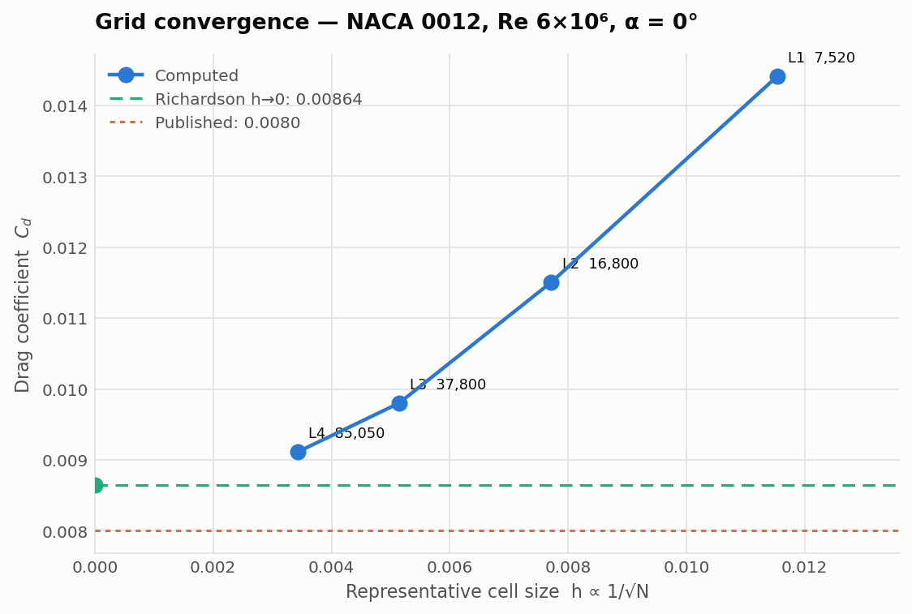

# NACA 0012 in OpenFOAM

A structured C-grid generated from parameters, a grid convergence study with a
Grid Convergence Index, and a ten-angle polar — with the limits of each stated
rather than left to be assumed.



## Headline results

| | |
|---|---|
| Mesh | 6-block structured C-grid, generated by `src/cgrid.py` |
| checkMesh | non-orthogonality 69.7 max (limit 70), skewness 1.00 |
| y+ | 0.45–0.93 at zero incidence — resolved, no wall functions |
| Observed order of convergence | **2.24** |
| Richardson extrapolation, h→0 | **Cd = 0.008645** |
| GCI on the finest grid | **6.4%** |
| Lift-curve slope | **0.10710/deg — 97.7% of 2π** |
| Zero-lift angle | **+0.0001°** (symmetry requires 0) |
| Best L/D | **46.9 at +8°** |

## Running it

```bash
colima start --cpu 4 --memory 4 --disk 20     # macOS; any Docker host works
./foam.sh 'blockMesh && checkMesh'
./foam.sh 'simpleFoam > log.simpleFoam 2>&1'

python -m pytest tests -q                     # 53 tests, no Docker needed
python study.py && python analyse.py          # mesh independence + GCI
python sweep.py && python polar.py            # alpha sweep + polars
```

`foam.sh` exists because the image's entrypoint runs a login shell that `cd`s to
the home directory, silently overriding docker's `-w`. OpenFOAM then reports
`Case : /root`, fails looking for `system/controlDict`, and anything it writes
lands in the container and vanishes with `--rm`.

## Four findings worth the repository

**A gradient limiter that was wrong and looked right.** `cellLimited Gauss
linear 1` is the safe default every tutorial reaches for. Here it reported
Cl = 0.049 for a symmetric section at zero incidence — where symmetry requires
exactly zero — and inflated Cd by 69%. It converged cleanly, residuals fell,
forces were flat from iteration 500. The only thing that exposed it was a
physical identity the answer had to satisfy. A test now pins the scheme, because
adding a limiter is the standard reflex when a run misbehaves.

**Three grids are Richardson's minimum, not proof of asymptotic behaviour.** On
the three coarsest levels the analysis reported an order of 1.31 and extrapolated
to 0.00737. Adding a fourth moved the order to 2.24 and the extrapolation to
0.008645 — the opposite side of the published value. The coarse answer was not
merely less precise; it was biased the other way, and it looked entirely
respectable. This is why the code computes the observed order instead of
assuming p = 2.

**The zero-lift angle picks the fit range.** Widening the lift-curve fit from
+4° to +10° walks the slope from 0.10710 to 0.10401 — 97.7% down to 94.8% of 2π
— and any of those could have been quoted. It also drags the fitted zero-lift
angle from +0.0001° to +0.0121°, and symmetry requires that to be exactly zero.
The drift is not physics; it is the fit reporting that it has swallowed points
which are no longer on a straight line.

**Never split a curve by comparing coordinates.** Cosine spacing puts the
mid-chord point at 0.49999999999999994, so `x <= 0.5` and `x < 0.5` both accept
it, and a block corner reappeared as an interior polyLine point on one surface
but not its mirror. Splitting by index is exact.

## What this does not show

**Stall.** Cl is still rising at +14° and no maximum is captured. Steady RANS
cannot resolve the separated flow that produces stall, so extending the sweep
would produce numbers rather than answers.

**Equal confidence at every angle.** y+ climbs from 0.95 at 0° to 3.34 at +14°
as the aerofoil loads. The mesh is sized for y+ ≈ 1 at *zero* incidence, and
SST's ω wall treatment blends up to roughly y+ 3, so the last two points deserve
less weight than the linear range.

**A comparison against experiment.** The reference plotted is thin aerofoil
theory, which is exact analysis. `compare.py` and `src/reference.py` exist to
compare against digitised wind tunnel data, and the loader **refuses any dataset
that does not declare its source, figure, Reynolds number, surface condition and
who digitised it**. A NACA 0012 at Re 6e6 has a minimum drag near 0.0060 smooth
and near 0.0085 with standard roughness — choosing the wrong one moves the
comparison by more than every numerical effect here combined. Fill in
`validation/reference/naca0012-template.json` from a source you have actually
read, and the comparison runs.

## Layout

```
src/cgrid.py       C-grid blockMeshDict generator
src/case.py        fields, properties and solver control from Re and alpha
src/airfoil.py     NACA 4-digit sections
src/reference.py   digitised experimental data, with provenance enforced
study.py           mesh independence sweep      analyse.py   GCI + figure
sweep.py           angle-of-attack sweep        polar.py     lift curve, polars
compare.py         computed vs experiment
foam.sh            run an OpenFOAM command against ./case
```
