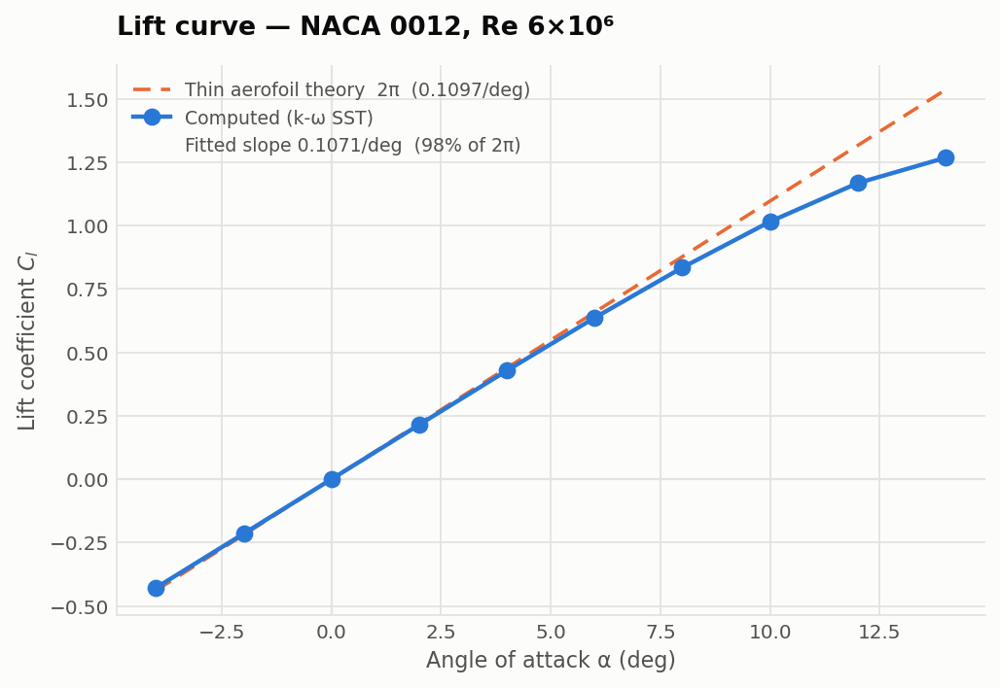

# 05 — OpenFOAM 2D airfoil simulation

Steady-state incompressible flow over a 2D airfoil using `simpleFoam`.

**Status:** In progress — mesh, case and solver running; validation sweep outstanding
**Tool:** OpenFOAM — <https://www.openfoam.com> (free). On macOS run it in
Docker; native builds are more trouble than they are worth.

## Objective

The benchmark comparison is the deliverable, not the contour plot. Computed Cl
and Cd curves plotted against published wind tunnel data — Abbott & Von
Doenhoff for NACA sections, or NASA Langley's NACA 0012 validation case.

Anyone can produce a colourful pressure field. Showing yours matches measured
data — or explaining exactly where and why it does not — is what makes this
worth a reviewer's time.

## Running it

```bash
colima start --cpu 4 --memory 4 --disk 20     # once per session
./foam.sh 'blockMesh && checkMesh'
./foam.sh 'simpleFoam > log.simpleFoam 2>&1'
/opt/anaconda3/envs/pyocc_env/bin/python -m pytest tests -q   # 24 tests, no Docker needed
```

`foam.sh` exists because the image's entrypoint runs a login shell that `cd`s to
the home directory, silently overriding docker's `-w`. OpenFOAM then reports
`Case : /root`, fails looking for `system/controlDict`, and anything it does
write lands in the container and vanishes with `--rm`.

## Where it stands

| | |
|---|---|
| Mesh | 16 800 cells, 6-block structured C-grid, generated by `src/cgrid.py` |
| checkMesh | non-orthogonality **69.7 max** (limit 70), skewness **1.00**, no negative volumes |
| y+ on the aerofoil | **0.45 – 0.93**, average 0.68 — resolved, no wall functions |
| Cl at α = 0 | **−4.2e-05** — symmetry holds, as a NACA 0012 requires |
| Cd at α = 0 | **0.009111** on the finest mesh; 0.008645 extrapolated to h→0 |

checkMesh reports one failure, high aspect ratio. That is inherent to a
boundary layer resolved to y+ < 1: the wall cell is 9.4 µm tall and 25 mm long.
The checks that actually break a solution all pass. Reducing the spanwise
thickness does **not** change it — the metric is driven by the in-plane cells,
which is worth knowing before spending time on it.

Cd being high on the base mesh is a resolution problem, not a setup one, and
the mesh independence study below settles it.

## Mesh independence

`study.py` refines **every** direction by 1.5 — including the near-wall spacing,
so y+ falls 2.2 → 1.4 → 0.95 across the sequence. Holding the wall spacing
fixed while refining only tangentially is the usual shortcut, and it invalidates
Richardson extrapolation because the meshes then differ in more than one
parameter.

| | cells | first cell | y+ max | Cd | Cl |
|---|---|---|---|---|---|
| L1 | 7 520 | 2.11e-05 | 2.20 | 0.014407 | +7.6e-07 |
| L2 | 16 800 | 1.40e-05 | 1.39 | 0.011505 | +1.8e-06 |
| L3 | 37 800 | 9.35e-06 | 0.95 | 0.009800 | +1.5e-07 |
| L4 | 85 050 | 6.24e-06 | 0.69 | **0.009111** | +1.5e-06 |

Monotone, and Cl stays at the 1e-6 level throughout — the symmetry the gradient
limiter destroyed holds at every refinement.


Roache's Grid Convergence Index on the three finest levels:

| | |
|---|---|
| Observed order of convergence | **p = 2.24** |
| Richardson extrapolation to h→0 | **Cd = 0.008645** |
| GCI on the finest grid | **6.4%** |
| Published (Abbott & Von Doenhoff) | 0.0080 |
| Extrapolated vs published | **+8.1%** |

### Why the fourth level mattered

On the three *coarsest* levels the same analysis reported p = 1.31, an
extrapolation of 0.00737 and a GCI of 31%. Adding L4 moved the observed order
to 2.24 — close to the scheme's formal second order — and cut the uncertainty
band to 6.4%.

The extrapolated value moved from 0.00737 to 0.008645, which is **the opposite
side of the published figure**. The coarse-grid answer was not merely less
precise, it was biased the other way, and it looked perfectly respectable at
the time: monotone sequence, plausible order, a number agreeing with published
data to 8%.

That is the argument for computing the observed order rather than assuming
p = 2, and for not trusting an extrapolation until the order it reports is
close to the scheme's. Three grids are the minimum the method needs; they are
not necessarily enough to be in the asymptotic range.

### The residual 8%

The discrepancy (+8.1%) slightly exceeds the numerical uncertainty (6.4%), so
it is not all discretisation — a modelling difference remains, and its sign is
the expected one.

k-omega SST with no transition model computes **fully turbulent** flow from the
leading edge. The published measurement is a smooth aerofoil at Re 6e6 with
natural transition, which leaves a laminar run over the forward chord and lower
skin friction with it. A fully turbulent computation should over-predict drag,
and about 8% is a reasonable size for that difference at this Reynolds number.

Confirming it needs a transition-sensitive model — `kOmegaSSTLM` is the obvious
next experiment — rather than being asserted here.

## Alpha sweep

Ten angles from −4° to +14° on the L3 mesh, incidence applied by rotating the
freestream so every point sits on the identical grid.

| α | Cl | Cd | Cl/Cd | y+ max | Cl drift |
|---|---|---|---|---|---|
| −4° | −0.4282 | 0.01166 | −36.7 | 1.57 | 4.8e-06 |
| −2° | −0.2147 | 0.01026 | −20.9 | 1.28 | 1.1e-05 |
| 0° | +0.0000 | 0.00980 | 0.0 | 0.95 | 8.0e-06 |
| +2° | +0.2146 | 0.01027 | 20.9 | 1.27 | 8.7e-06 |
| +4° | +0.4282 | 0.01167 | 36.7 | 1.57 | 5.3e-06 |
| +6° | +0.6363 | 0.01413 | 45.0 | 2.02 | 1.1e-05 |
| +8° | +0.8343 | 0.01780 | **46.9** | 2.36 | 1.1e-04 |
| +10° | +1.0155 | 0.02278 | 44.6 | 2.71 | 1.5e-05 |
| +12° | +1.1674 | 0.02947 | 39.6 | 3.06 | 3.9e-05 |
| +14° | +1.2673 | 0.03905 | 32.5 | 3.34 | 1.2e-04 |



| | |
|---|---|
| Lift-curve slope, −4..+4° | **0.10710 /deg** |
| Thin aerofoil theory, 2π | 0.10966 /deg |
| Ratio | **97.7%** |
| Zero-lift angle | **+0.0001°** |
| Best L/D | **46.9 at +8°** |

97.7% is the expected answer rather than a near miss: a real 12% section sits a
few percent below 2π through thickness and viscous decambering. Landing *above*
2π would have meant something was wrong.

### The section checks itself

It is symmetric, so the sweep carries its own validation and passes it at every
matched pair — Cl(−4°) = −0.4282 against +0.4282, Cl(−2°) = −0.2147 against
+0.2146, with Cd agreeing to five decimals. That exercises the mesh under real
loading on both sides, which the zero-incidence case alone does not. Cd at 0° is
0.00980, matching the L3 value from the mesh study exactly.

### Choosing the fit range, and why the zero-lift angle decides it

| fit range | slope | % of 2π | α₀ |
|---|---|---|---|
| −4..+4 | 0.10710 | 97.7% | +0.0001° |
| −4..+6 | 0.10665 | 97.3% | +0.0057° |
| −4..+8 | 0.10567 | 96.4% | +0.0119° |
| −4..+10 | 0.10401 | 94.8% | +0.0121° |

A wider range gives a lower slope, and any of those numbers could be quoted. The
zero-lift angle settles it: symmetry requires it to be **exactly zero**, so its
drift from +0.0001° to +0.0121° is not physics, it is the fit reporting that it
has swallowed points which are no longer on a straight line. The diagnostic
chooses the range rather than the range being a matter of taste.

Departure from that fit is smooth and monotone — −1.0% at +6°, −2.6% at +8°,
−5.2% at +10°, −9.2% at +12°, −15.5% at +14° — which is decambering as the
boundary layer thickens, not numerical drift.

### What this sweep does not show

**Stall.** Cl is still rising at +14° (1.2673) and no maximum is captured. A real
NACA 0012 stalls near 16° with Cl_max about 1.6. Steady RANS cannot resolve the
separated flow that produces stall, so extending the sweep would produce numbers
rather than answers.

**Equal confidence at every angle.** y+ max climbs from 0.95 at 0° to 3.34 at
+14° as the aerofoil loads up. The mesh was sized for y+ ≈ 1 at *zero*
incidence. SST's ω wall treatment blends up to roughly y+ 3, so +12° and +14°
sit at or past that edge and deserve less weight than the linear-range points.
Resolving the loaded condition properly needs a mesh sized for it.

**A comparison with experiment.** The reference plotted here is thin aerofoil
theory, which is exact analysis. Published points from Abbott & Von Doenhoff are
deliberately not hard-coded — a curve reconstructed from memory looks
authoritative and cannot be checked. Digitise the source before presenting this
as validation against wind tunnel data.

## Core concepts

- OpenFOAM case hierarchy and dictionary configuration
- Structured C-grid generation with `blockMesh`
- Wall-bounded turbulence, y+ ≈ 1, k-omega SST
- Convergence assessment and force coefficient extraction

## Case structure

```
case/
  0/          U, p, k, omega, nut          initial and boundary fields
  constant/   turbulenceProperties, polyMesh
  system/     blockMeshDict, fvSchemes, fvSolution, controlDict
```

## Workflow

1. **Mesh** — C-grid around NACA 0012 via `blockMeshDict`. Grade toward the
   wall so first-cell height gives y+ ≤ 1 at your Reynolds number. Compute that
   height beforehand; do not guess it.
2. **Fields** — set `U`, `p`, `k`, `omega`, `nut` in `0/`. Inlet turbulence
   quantities should reflect the wind tunnel you are comparing against.
3. **Solver** — bounded second-order upwind for divergence in `fvSchemes`;
   convergence criteria in `fvSolution`; add the `forces` function object to
   `controlDict` so Cl and Cd are logged every iteration.
4. **Run:**
   ```bash
   blockMesh && checkMesh && simpleFoam > log.simpleFoam 2>&1 &
   ```
   `checkMesh` must pass before `simpleFoam`. A mesh with non-orthogonality
   above ~70 will produce numbers, and they will be wrong.
5. **Post-process** — `paraFoam`. Pressure contours, boundary layer profiles,
   trailing-edge flow.

## Validation

- [ ] y+ verified from the solution, not just estimated beforehand
- [ ] Residuals converged, and force coefficients flat — residuals alone are
      not convergence
- [x] Mesh independence across four refinements, with GCI
- [x] Cl vs alpha, drag polar and efficiency across −4..+14°
- [ ] Comparison against digitised Abbott & Von Doenhoff data
- [ ] Cd vs alpha plotted against published data, with the discrepancy
      discussed honestly

Steady RANS will not match experiment past stall. Say that in the write-up
instead of stopping the sweep where the agreement stops looking good.

## Deliverables

- [ ] Complete, runnable case in `case/`
- [ ] Validation plots in `validation/`
- [ ] Figures for the site and LinkedIn
- [ ] Its own GitHub repository

## Repository hygiene

Commit `0/`, `constant/` (minus `polyMesh`) and `system/`. Never commit time
directories, `polyMesh/` or VTK output — the root `.gitignore` excludes them.
The case dictionaries are the work; everything else regenerates.

## Two findings worth keeping

**The gradient limiter was wrong, and it looked right.** `cellLimited Gauss
linear 1` is the safe default that every tutorial reaches for. On this case it
reported **Cl = 0.049 for a symmetric section at zero incidence**, where
symmetry requires exactly zero, and inflated Cd from 0.0116 to 0.0196. The
limiter is nonlinear, so it clips gradients asymmetrically inside the boundary
layer and adds spurious diffusion. Switching to unlimited `Gauss linear`
restored symmetry to 4e-05 and cut drag by 41%.

Nothing about the limited run looked wrong: it converged cleanly, residuals
fell, forces were flat from iteration 500. The only thing that gave it away was
a physical identity the answer had to satisfy — a symmetric aerofoil at zero
incidence generates no lift. A test now pins the scheme so the reflex of adding
a limiter cannot quietly reintroduce both errors.

**Never split a curve by comparing coordinates.** Cosine spacing puts the
mid-chord point at 0.49999999999999994, so `x <= 0.5` and `x < 0.5` both accept
it. The block corner then reappeared as an interior polyLine point on one
surface but not its mirror. Splitting by index is exact. This one turned out
not to be the cause of the asymmetry above — blockMesh collapses the duplicate
— but it was a real defect found while looking for it.

## Log

| Date | What was done |
|---|---|
| 2026-08-20 | Alpha sweep, ten angles on the L3 mesh. Lift-curve slope 0.1071/deg, 97.7% of 2π, zero-lift angle +0.0001°. Best L/D 46.9 at +8°. The fit range turned out to matter: widening it to +8 drops the slope to 0.1057 and drags the zero-lift angle to +0.0119°, which symmetry says cannot be physical — so the zero-lift angle is the diagnostic that picks the range. No stall captured; y+ reaches 3.34 by +14°, past where the wall treatment blends cleanly. |
| 2026-08-19 | Mesh independence study: four levels, 7.5k to 85k cells, refining wall spacing with everything else so Richardson applies. Observed order 2.24, extrapolated Cd 0.008645, GCI 6.4%. The three coarsest levels alone gave p=1.31 and an extrapolation on the opposite side of the published value — a good reminder that three grids are the method's minimum, not proof of asymptotic behaviour. |
| 2026-08-19 | OpenFOAM v2512 running natively on arm64 under colima. `src/cgrid.py` generates a 6-block structured C-grid — six because blockMesh identifies an edge by its vertex pair, so the whole upper and whole lower surface would both be edge (LE, TE) and only one can exist; splitting each surface at mid-chord gives every curved edge a unique pair. `src/case.py` generates fields, properties and solver control from Re and alpha. y+ tuned to ~1 by solving the geometric series for the radial grading. Found the gradient limiter breaking symmetry. 24 tests. |
