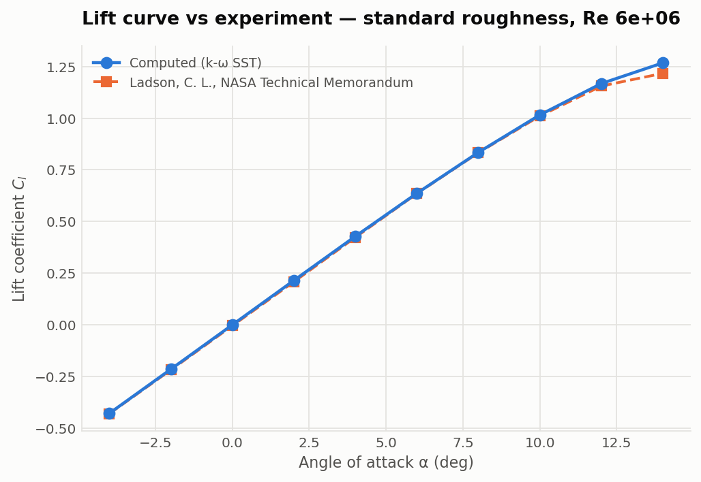

# NACA 0012 in OpenFOAM

A structured C-grid generated from parameters, a grid convergence study with a
Grid Convergence Index, and a ten-angle polar — with the limits of each stated
rather than left to be assumed.


## Headline results

| | |
|---|---|
| Mesh | 6-block structured C-grid, generated by `src/cgrid.py` |
| checkMesh | non-orthogonality 69.7 max (limit 70), skewness 1.00 |
| y+ | 0.45–0.93 at zero incidence — resolved, no wall functions |
| Observed order of convergence | **2.24** |
| Richardson extrapolation, h→0 | **Cd = 0.008645** |
| GCI on the finest grid | **6.4%** |
| Lift-curve slope | **0.10710/deg — 97.7% of 2π** |
| Zero-lift angle | **+0.0001°** (symmetry requires 0) |
| Best L/D | **46.9 at +8°** |
| Lift vs experiment | **mean \|ΔCl\| = 0.0092** over −4..+14° |
| Grid-converged drag vs experiment | **−3.4%**, inside the 6.4% GCI band |

## Running it

```bash
colima start --cpu 4 --memory 4 --disk 20     # macOS; any Docker host works
./foam.sh 'blockMesh && checkMesh'
./foam.sh 'simpleFoam > log.simpleFoam 2>&1'

python -m pytest tests -q                     # 53 tests, no Docker needed
python study.py && python analyse.py          # mesh independence + GCI
python sweep.py && python polar.py            # alpha sweep + polars
```

`foam.sh` exists because the image's entrypoint runs a login shell that `cd`s to
the home directory, silently overriding docker's `-w`. OpenFOAM then reports
`Case : /root`, fails looking for `system/controlDict`, and anything it writes
lands in the container and vanishes with `--rm`.

## Four findings worth the repository

**A gradient limiter that was wrong and looked right.** `cellLimited Gauss
linear 1` is the safe default every tutorial reaches for. Here it reported
Cl = 0.049 for a symmetric section at zero incidence — where symmetry requires
exactly zero — and inflated Cd by 69%. It converged cleanly, residuals fell,
forces were flat from iteration 500. The only thing that exposed it was a
physical identity the answer had to satisfy. A test now pins the scheme, because
adding a limiter is the standard reflex when a run misbehaves.

**Three grids are Richardson's minimum, not proof of asymptotic behaviour.** On
the three coarsest levels the analysis reported an order of 1.31 and extrapolated
to 0.00737. Adding a fourth moved the order to 2.24 and the extrapolation to
0.008645 — the opposite side of the published value. The coarse answer was not
merely less precise; it was biased the other way, and it looked entirely
respectable. This is why the code computes the observed order instead of
assuming p = 2.

**The zero-lift angle picks the fit range.** Widening the lift-curve fit from
+4° to +10° walks the slope from 0.10710 to 0.10401 — 97.7% down to 94.8% of 2π
— and any of those could have been quoted. It also drags the fitted zero-lift
angle from +0.0001° to +0.0121°, and symmetry requires that to be exactly zero.
The drift is not physics; it is the fit reporting that it has swallowed points
which are no longer on a straight line.

**Never split a curve by comparing coordinates.** Cosine spacing puts the
mid-chord point at 0.49999999999999994, so `x <= 0.5` and `x < 0.5` both accept
it, and a block corner reappeared as an interior polyLine point on one surface
but not its mirror. Splitting by index is exact.

## What this does not show

**Stall.** Cl is still rising at +14° and no maximum is captured. Steady RANS
cannot resolve the separated flow that produces stall, so extending the sweep
would produce numbers rather than answers.

**Equal confidence at every angle.** y+ climbs from 0.95 at 0° to 3.34 at +14°
as the aerofoil loads. The mesh is sized for y+ ≈ 1 at *zero* incidence, and
SST's ω wall treatment blends up to roughly y+ 3, so the last two points deserve
less weight than the linear range.

**Stall, in the experiment either.** The measurement stalls between 14.02° and
15.06° with Cl_max 1.2169. The computation is still climbing at +14° and gives
1.2673 there, 4.2% high — steady RANS cannot resolve the separated flow, so the
last point is the least trustworthy in the sweep.

## Comparison against experiment

Reference: **Ladson, NASA TM 4074 (1988)**, Table VII — M = 0.15, transition
fixed with No. 60-W grit, R = 6.00 × 10⁶, Langley Low-Turbulence Pressure
Tunnel. The tripped case is the right comparison because this computation is
fully turbulent from the leading edge with no transition model.



| α | Cl | Cl exp | ΔCl | Cd | Cd exp | Δ counts |
|---|---|---|---|---|---|---|
| −4° | −0.4282 | −0.4297 | +0.0015 | 0.01166 | 0.01037 | +12.9 |
| −2° | −0.2147 | −0.2182 | +0.0035 | 0.01026 | 0.00904 | +12.2 |
| 0° | +0.0000 | −0.0043 | +0.0043 | 0.00980 | 0.00895 | +8.5 |
| +2° | +0.2146 | +0.2081 | +0.0065 | 0.01027 | 0.00944 | +8.3 |
| +4° | +0.4282 | +0.4231 | +0.0050 | 0.01167 | 0.00975 | +19.1 |
| +6° | +0.6363 | +0.6348 | +0.0015 | 0.01413 | 0.01115 | +29.7 |
| +8° | +0.8343 | +0.8324 | +0.0019 | 0.01780 | 0.01402 | +37.8 |
| +10° | +1.0155 | +1.0102 | +0.0053 | 0.02278 | 0.01898 | +38.0 |
| +12° | +1.1674 | +1.1552 | +0.0122 | 0.02947 | 0.02530 | +41.6 |
| +14° | +1.2673 | +1.2167 | +0.0506 | 0.03905 | 0.03873 | +3.2 |

**Lift agrees to a mean absolute error of 0.0092** across the whole sweep, and
to better than 0.007 everywhere below +12°. The +14° point is the worst at
+0.051, which is the computation failing to stall rather than a modelling error
in the attached régime.

**Drag on the L3 mesh runs 8 to 42 counts high**, and most of that is
discretisation rather than physics. The mesh study extrapolates Cd at zero
incidence to **0.008645** against a measured **0.00895** — **−3.4%**, which
sits *inside* the 6.4% GCI band. The computation therefore agrees with
experiment to within its own numerical uncertainty, and the L3 discrepancy is
the grid, not the model.

### The reference constant was wrong, and that is the point

Before the data was digitised this repository carried `PUBLISHED_CD = 0.0080`,
written from memory. That figure belongs to a **smooth** aerofoil with free
transition. The tripped case at Re 6 × 10⁶ is **0.00895** — a 12% difference,
and in the direction that matters:

| reference used | extrapolated Cd vs it |
|---|---|
| 0.0080, from memory | **+8.1%** |
| 0.00895, Ladson TM 4074 tripped | **−3.4%** |

The bad constant made the model look worse than it is *and* pointed the error
the wrong way. Nothing about it looked suspicious. `analyse.py` no longer holds
a drag constant at all — it reads the digitised reference, so the failure mode
cannot recur.

The exact document is pinned by checksum in the reference file
(`sha256 8e466706…`), so anyone can confirm they are reading the same edition
rather than a different scan with different pagination. Points come from PDF
pages 18–19, report pages 16–17.

### How the digitisation was checked

TM 4074 prints its own lift-to-drag column beside Cl and Cd. Every one of the 14
rows was checked by confirming Cl/Cd reproduces it, worst disagreement 0.024 —
consistent with rounding at four to five significant figures. A transposed or
misread digit in either coefficient breaks that ratio while both numbers still
look plausible alone, so the loader now enforces the check on any dataset that
carries an `l_over_d` field.

## Layout

```
src/cgrid.py       C-grid blockMeshDict generator
src/case.py        fields, properties and solver control from Re and alpha
src/airfoil.py     NACA 4-digit sections
src/reference.py   digitised experimental data, with provenance enforced
study.py           mesh independence sweep      analyse.py   GCI + figure
sweep.py           angle-of-attack sweep        polar.py     lift curve, polars
compare.py         computed vs experiment
validation/reference/  digitised experimental data + a refused template
foam.sh            run an OpenFOAM command against ./case
```
